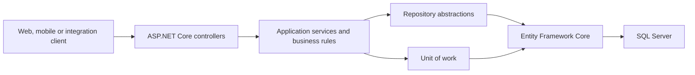

# Inventory Management API

[](https://github.com/TomWilliam95/InventoryManagementAPI/actions/workflows/ci.yml)

A secure ASP.NET Core REST API for maintaining consistent inventory records across products, warehouses, suppliers and stock movements.

## Project vision

I began this project with the goal of creating a universal inventory-tracking system: one reliable place where an organisation could maintain consistent records of what it owns, where stock is held, where it came from and how quantities have changed over time.

More recently, I decided to evolve the project toward the needs of scalable e-commerce. The current API establishes the underlying catalogue, supplier, warehouse, identity and inventory domains needed for that direction. The longer-term goal is to support purchasing and sales workflows, event-driven integrations and AI-assisted analytics for demand forecasting, stock anomalies and reorder recommendations.

AI analytics are part of the roadmap and are not represented as a completed feature in the current release.

## Current capabilities

- Product and category management
- Stock records across multiple warehouses
- Auditable stock-in, stock-out, purchase, sale and adjustment movements
- Supplier contacts, addresses and product relationships
- Preferred suppliers and supplier-specific product details
- User registration and JWT authentication
- Role-based access for administrative and management operations
- Optimistic concurrency protection for multi-user updates
- Consistent API response contracts and asynchronous operations
- Swagger/OpenAPI documentation in development
- Automated unit and SQL Server integration testing

## Technology

- C# and ASP.NET Core 9
- Entity Framework Core 9
- SQL Server
- JWT bearer authentication
- BCrypt password hashing
- xUnit and Moq
- Testcontainers for SQL Server integration tests
- GitHub Actions for continuous integration and coverage collection

## Architecture

The API uses a layered structure to keep HTTP handling, business rules and persistence concerns separate.



The main domains are:

- **Catalogue:** products and categories
- **Inventory:** warehouses, stock balances and inventory movements
- **Suppliers:** suppliers, contacts, addresses and product assignments
- **Identity:** users, roles, permissions and authentication
- **Commerce foundation:** customer, purchase-order and sales-order entities for future development

## Security

The API issues signed JWT bearer tokens after successful login. Protected endpoints require authentication, while higher-risk operations use role-based authorization for `Admin` or `Manager` users.

Passwords are stored as BCrypt hashes. The JWT signing key is deliberately excluded from source control and must be supplied through .NET user secrets or environment configuration.

## Getting started

### Prerequisites

- [.NET 9 SDK](https://dotnet.microsoft.com/download/dotnet/9.0)
- SQL Server or SQL Server Express
- Docker Desktop, if you want to run the integration tests

### 1. Clone the repository

```bash
git clone https://github.com/TomWilliam95/InventoryManagementAPI.git
cd InventoryManagementAPI
```

### 2. Configure the database

The default development connection expects SQL Server Express on Windows:

```text
Server=.\SQLEXPRESS;Database=Inventory_Management;Trusted_Connection=true;TrustServerCertificate=true
```

To use another SQL Server instance, provide `ConnectionStrings:SSMS` through user secrets or environment configuration.

### 3. Configure the JWT signing key

From the repository root:

```bash
dotnet user-secrets set "Jwt:Key" "replace-with-a-long-random-development-key"
```

Do not use the example value in a deployed environment.

### 4. Create the database

Install the EF Core command-line tool if required, then apply the migration:

```bash
dotnet tool install --global dotnet-ef
dotnet ef database update
```

### 5. Run the API

```bash
dotnet run --project InventoryManagementAPI.csproj
```

In development, Swagger UI is available at:

```text
https://localhost:7094/swagger
```

## Testing

The solution currently contains **182 automated tests** covering service rules, authorization metadata, repositories, relational constraints and optimistic concurrency.

Start Docker Desktop before running the complete suite. Testcontainers will create and dispose of an isolated SQL Server container automatically.

```bash
dotnet test InventoryManagementAPI.sln --configuration Release
```

The GitHub Actions workflow restores and builds the solution, runs the complete test suite and uploads test results and code coverage as workflow artifacts.

## Example API areas

| Area | Base route | Examples |
|---|---|---|
| Authentication | `/api/auth` | Login and JWT issuance |
| Users | `/api/users` | Accounts, roles and profile updates |
| Products | `/api/products` | Catalogue details, prices and reorder queries |
| Categories | `/api/categories` | Product classification |
| Inventory stock | `/api/inventory-stocks` | Warehouse balances and reorder levels |
| Inventory movements | `/api/inventory-movements` | Stock history, types and date-range queries |
| Suppliers | `/api/suppliers` | Suppliers, contacts, addresses and product relationships |

Swagger provides the complete request and response contracts when the application is running in development.

## Roadmap

- Complete purchase-order and sales-order workflows
- Add pagination, filtering and sorting for large catalogues
- Introduce event-driven low-stock and order-processing integrations
- Deploy the API and database to Microsoft Azure
- Add health checks, centralized problem responses and production telemetry
- Build an e-commerce administration interface with React and TypeScript
- Develop AI-assisted analytics for demand forecasting, anomaly detection and reorder recommendations
- Upgrade to the current .NET LTS release

## Status

This is an actively developed portfolio project. It demonstrates the current backend foundation and engineering approach; the e-commerce, Azure and AI capabilities described in the roadmap are planned extensions.

## License

This project is available under the [MIT License](LICENSE.txt).
